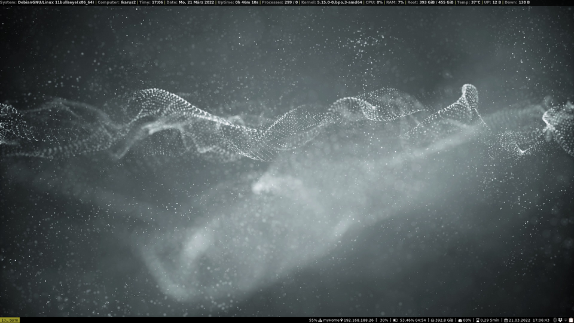
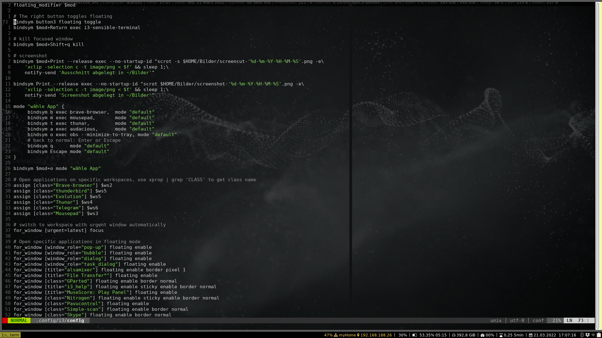
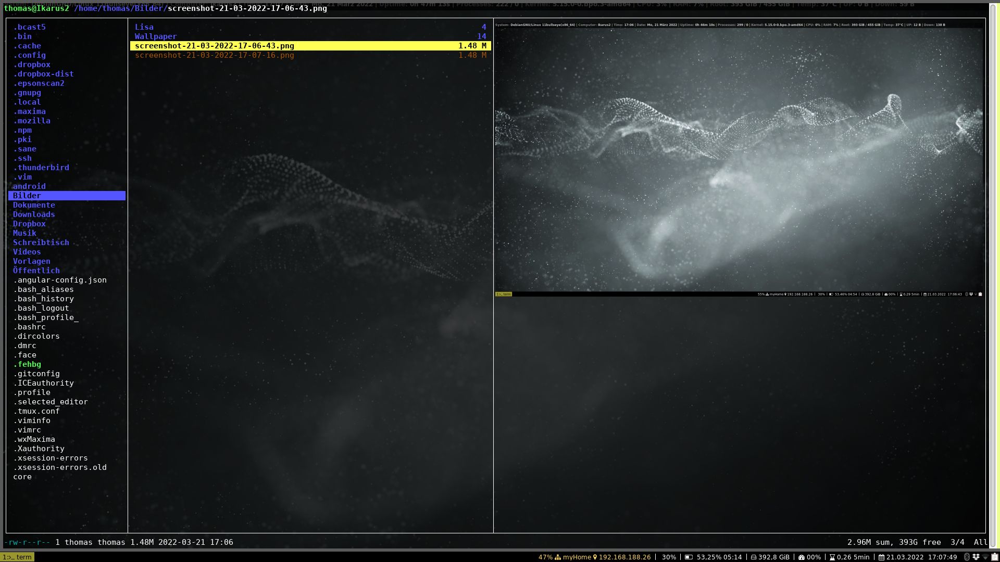

# TT's i3 configuration

**my personal i3 configuration**

### What you need...
```
i3
i3-wm
i3lock
i3status
dunst
rofi
conky
suckless-tools (for dmenu)
fonts-hack
feh
scrot
imagemagick (for mogrify)
compton (transparency, shadows)
```
I used the XFCE DE as a base system so several useful apps like nm-applet etc. are listed for tray-applications.
This depends on you and you will configure your own i3 for your needs.

### some other useful stuff:
```
ranger
nm-applet
blueman-applet
xfce4-clipman
gnome-keyring-daemon
numlockx
xbacklight
Brave-Browser (Debian needs additional repository)
Thunderbird
Thunar
Mousepad
xautolock
```
For the colors of your choice you can use the link:
https://thomashunter.name/i3-configurator/

### Screenshots







